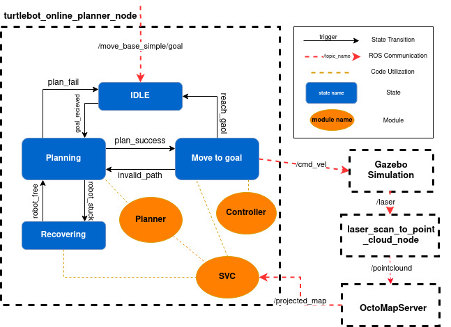

# Online Path Planning ROS Package

## Overview

This ROS package implements an online path planning algorithm for robotic navigation. It comprises three main modules: `StateValidityChecker`, `Planner`, and `Controller`. These modules are utilized by the `turtlebot_online_path_planning_node.py` script to generate a sequence of online path planning actions. Additionally, this script manages the connection between the Turtlebot in the Gazebo simulation environment via ROS.

To simplified the sequences, the online path planning process can be depicted as a state machine with the following states:

1. **IDLE State:** The robot waits in the IDLE state until it receives a goal.
2. **Planning State:** Upon receiving a goal, the robot transitions to the Planning state, where the Planner module calculates a path to the goal.
3. **Move to Goal State:** Once a valid path is computed, the robot transitions to the Move to Goal state. Here, the Controller module determines the velocity commands required for the robot to follow the planned path and publishes them to the `/cmd_vel` topic. As the map progress by updating through the new gridmap from `OctoMapServer` node, the validity of the current path is continuously checked by utilizing `check_path()`. If the path becomes invalid due to changes in the environment, the robot returns to the Planning state to recalculate the path.
5. **Recovery State:** If the robot becomes stuck due to obstacles, it enters the Recovery state before planning a new path. The robot ensures its current position's validity by utilizing the `is_valid()` function from the StateValidityChecker module. The recovery action persists until the robot is no longer stuck.

The algorithm flow and the connection to other ROS nodes are illustrated in the figure below.

  

## Publishers

1. **Command Velocity (`/cmd_vel`):** Sends velocity commands for robot movement. 

2. **Path Visualization (`/turtlebot_online_path_planning/path_marker`):** Visualizes planned paths in RViz.

3. **Waypoints Visualization (`/turtlebot_online_path_planning/waypoints_marker`):** Visualizes waypoints in RViz.

## Subscribers

1. **Grid Map (`/projected_map`):** Receives grid map data from Octomap Server. 

2. **Odometry (`/odom`):** Subscribes to odometry data for path planning. 

3. **Goal (`/move_base_simple/goal`):** Subscribes to move goals for path planning.

## Modifications 
### Path Planning with RRT Algorithm

In the planning module, we've implemented the Rapidly-exploring Random Tree (RRT) algorithm. While the core principles of RRT are followed, we've made modifications in how we verify the validity of the tree's segments.

Previously, we access the configuration space directly. Now, we've integrated the StateValidityChecker module, specifically utilizing its `check_path()` function for validation.

Moreover, to adapt to various scenarios, several parameters are adjustable:

- **`max_time`:** Maximum execution time before returning a failure.
- **`delta_q`:** Maximum distance between nodes.
- **`p_goal`:** Probability of selecting a goal point.
- **`dominion`:** Position limit of the node; nodes cannot be generated outside this boundary.

### Recovery Behavior
### Path Visualization

## Potential Issues
### Robot collide with obstacle
### Non-optimized path
### Deviation from Expected Path

## Demo 
### Demo Video 
### Recovery Behavior video
